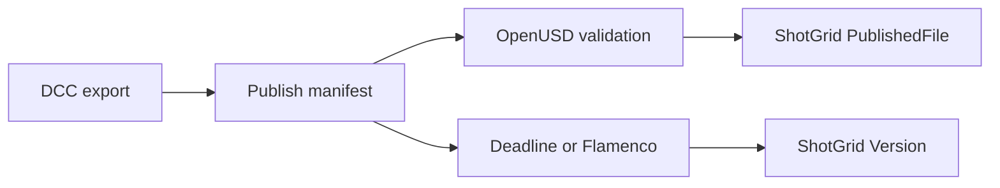

# dcc-pipeline-publish

Portable release and publish skills for DCC-MCP production workflows.

The repository currently owns four engine-neutral contracts:

- `pipeline-publish` records verified DCC exports for downstream production systems.
- `game-release-package` turns an already exported Windows game into an installer,
  SteamPipe preview configuration, or WeGame submission preflight.
- `game-runtime-acceptance` launches or validates a prebuilt game against
  structured milestones, performance thresholds, and hash-bearing evidence.
- `game-pv-capture` plans and preserves exact-window, hash-verified gameplay
  shots before HyperFrames editing.

## Why a manifest

The skill does not reimplement ShotGrid, OpenUSD, or Deadline. It records the
immutable files, hashes, entity identity, version, and optional farm job in one
JSON handoff that existing adapters can consume.

See [`references/WORKFLOW.md`](skill/pipeline-publish/references/WORKFLOW.md)
for the agent orchestration recipe.

## Game releases

Game engines remain responsible for building playable content. After Unreal,
Unity, or Godot exports a complete Windows directory, `game-release-package`
handles the distribution-specific handoff without importing an engine SDK.

See the [game release workflow](skill/game-release-package/references/WORKFLOW.md)
for prerequisites, profile behavior, and safety boundaries.

Runtime acceptance remains a separate gate. See the
[game runtime workflow](skill/game-runtime-acceptance/references/WORKFLOW.md) for
bounded launch behavior, structured event rules, and evidence ownership.

Gameplay capture remains separate from runtime acceptance and editing. See the
[game PV capture workflow](skill/game-pv-capture/references/WORKFLOW.md) for
multi-instance routing, exact-window recording, and frame evidence rules.

