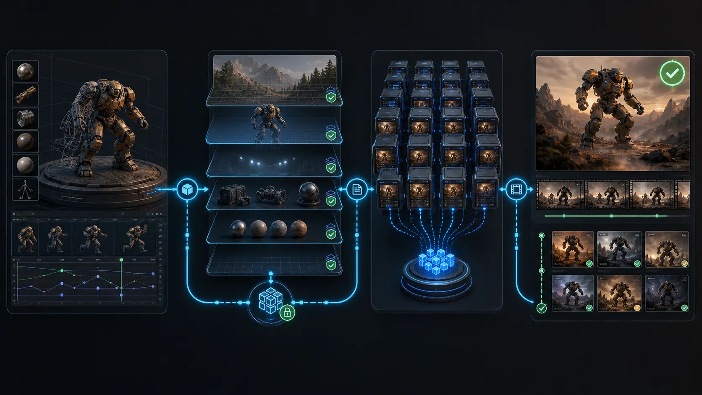
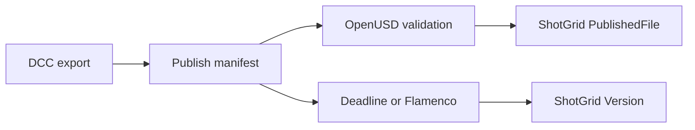

# dcc-pipeline-publish

A small, portable publish-manifest contract connecting DCC exports, OpenUSD
validation, render-farm jobs, and Autodesk Flow Production Tracking.

## Why a manifest

The skill does not reimplement ShotGrid, OpenUSD, or Deadline. It records the
immutable files, hashes, entity identity, version, and optional farm job in one
JSON handoff that existing adapters can consume.

See [`references/WORKFLOW.md`](skill/pipeline-publish/references/WORKFLOW.md)
for the agent orchestration recipe.

