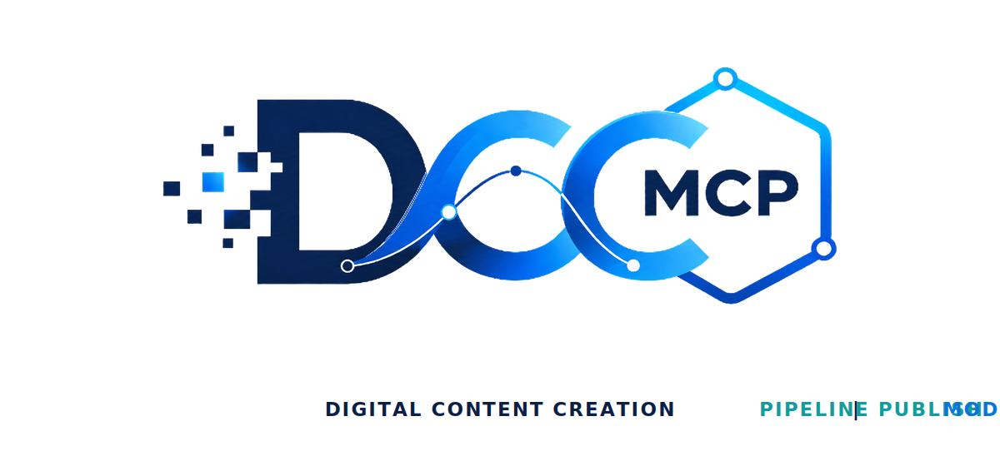
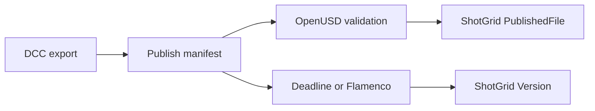

# dcc-pipeline-publish

<p align="center">
  
</p>

## Agent workflow

AI agents should use installed package skills through the shared gateway. IDE
users may continue to use the MCP endpoint.

### Install or update the CLI

`dcc-mcp-cli` is the preferred control path for every shell-capable agent. If
it is missing, ask the user before installing the latest official release:

```bash
# Linux/macOS
curl -fsSL https://raw.githubusercontent.com/dcc-mcp/dcc-mcp-core/main/scripts/install-cli.sh | sh

# Windows PowerShell
powershell -ExecutionPolicy Bypass -c "irm https://raw.githubusercontent.com/dcc-mcp/dcc-mcp-core/main/scripts/install-cli.ps1 | iex"
```

Keep an official build current through the release manifest:

```bash
dcc-mcp-cli update check
dcc-mcp-cli update apply
```

`update apply` downloads and stages the latest CLI for the next launch. It
does not update a running `dcc-mcp-server`; update that server in its own
environment.

```bash
dcc-mcp-cli dcc-types
dcc-mcp-cli list
dcc-mcp-cli search --query "<task>" --dcc-type <host>
dcc-mcp-cli describe <tool-slug>
dcc-mcp-cli call <tool-slug> --json '{"key":"value"}'
```

If the package skill is not active, call
`dcc-mcp-cli load-skill <skill-name> --dcc-type <host>`. After the task,
query `dcc-mcp-cli stats --range 24h --session-id <task-id>` and pass only
bounded evidence to the `review_skill_improvement` prompt from
`dcc-mcp-skills-creator`.


A small, portable publish-manifest contract connecting DCC exports, OpenUSD
validation, render-farm jobs, and Autodesk Flow Production Tracking.


## Why a manifest

The skill does not reimplement ShotGrid, OpenUSD, or Deadline. It records the
immutable files, hashes, entity identity, version, and optional farm job in one
JSON handoff that existing adapters can consume.



See [`references/WORKFLOW.md`](skill/pipeline-publish/references/WORKFLOW.md)
for the agent orchestration recipe.

